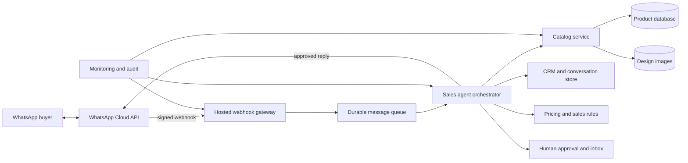

# WhatsApp AI Sales Agent Roadmap

## Objective

Turn the Chandni Silk Mills catalog and the existing `C:\Users\kinge\whatsapp-crm`
project into a dependable WhatsApp sales assistant that can understand buyer needs,
recommend suitable fabrics, share products, collect order requirements, and hand the
conversation to a person when necessary.

The target is an assisted B2B sales system. The AI may recommend and draft replies,
but prices, availability, credit, dispatch commitments, and final orders remain under
business control.

## Current Starting Point

### Catalog project

- Cloudflare Pages frontend with D1 metadata and R2 images.
- Upload, real-price administration, hide/restore, customer catalog, share pages,
  analytics, and an hourly Meta catalog feed.
- Product records currently contain little more than an image, name, price, order,
  creation date, and active status.
- Meta currently receives `1 INR` as a placeholder and `Price on request` rather than
  the real website price.

### WhatsApp CRM project

- Working Meta WhatsApp Cloud API webhook receiver and Graph API sender.
- Browser conversation inbox, contacts, messages, delivery statuses, templates, and
  24-hour customer-service-window enforcement.
- Private order-PDF workflow with admin confirmation.
- Runs as a single Node process on a Windows PC behind ngrok.
- Stores conversations and customer PII in `data/db.json`.
- Has no AI orchestration, durable hosted runtime, structured catalog retrieval,
  recommendation evaluation, user roles, or production monitoring.

## Target Architecture

The catalog database should be the product source of truth. The CRM should own
customers, conversations, consent, assignments, and orders. The AI should call
explicit tools instead of reading raw files or inventing product facts.

## Guiding Rules

1. Never let the model invent price, stock, MOQ, composition, delivery date, or credit terms.
2. Every recommendation must reference active catalog records returned by a tool.
3. Real prices remain governed by a clear visibility policy; remove the ambiguous word `private` until that policy is decided.
4. A person approves exceptional discounts, final quotations, credit, and confirmed orders.
5. Webhooks acknowledge quickly and process work asynchronously with idempotency.
6. Store the minimum required customer data, define retention, and record consent and opt-out state.
7. Every automated message must be reconstructable from its input, tool results, model version, and policy decision.
8. Keep a reliable non-AI fallback so the inbox and manual replies continue during model outages.

## Phase 0 — Business Decisions and Platform Validation

**Duration:** 2–3 working days  
**Goal:** remove ambiguous requirements before changing infrastructure.

### Decisions

- Decide whether website prices are public, login protected, customer specific, or never shown.
- Decide what Meta and WhatsApp customers should see instead of a real price. Validate the actual device rendering and Commerce Manager diagnostics; do not assume `1 INR` is acceptable long term.
- Confirm whether the current business number can use the required Cloud API setup while preserving the desired WhatsApp Business phone-app workflow. Test coexistence or plan a controlled number migration.
- Define agent boundaries: recommend, answer FAQs, qualify leads, prepare quotes, create draft orders, or confirm orders.
- Define mandatory human approvals and operating hours.
- Define supported languages: English, Hindi, Gujarati, or Hinglish.

### Exit criteria

- Written price visibility policy.
- Tested message and product rendering on the actual customer WhatsApp surface.
- Approved automation boundary and escalation rules.
- Confirmed phone-number and WABA migration/coexistence plan.

## Phase 1 — Stabilize the Catalog Foundation

**Duration:** 1–2 weeks  
**Goal:** make product facts reliable enough for software-driven recommendations.

### Product schema

Add stable fields to `designs` or normalized related tables:

| Field | Purpose |
|---|---|
| `sku` | Permanent business-facing identity |
| `image_key` and `image_mime` | Stop assuming every image is `{design_id}.jpg` |
| `fabric_type` | Chanderi, organza, silk blend, etc. |
| `composition` | Material facts the agent can state |
| `colors` | Searchable normalized colours |
| `pattern` | Floral, geometric, plain, embroidered, etc. |
| `width` | Sale-relevant width |
| `unit` | Metre, piece, set, roll, etc. |
| `moq` | Minimum order quantity |
| `availability` | Draft, available, low stock, reserved, sold out, archived |
| `lead_time_days` | Dispatch expectation |
| `use_cases` | Saree, dress, kurta, lehenga, furnishing, etc. |
| `tags` | Additional controlled search terms |
| `updated_at` | Change and cache tracking |

### Data integrity and security

- Key prices only by `design_id` with a database relationship; migrate filename aliases.
- Fix image-extension hardcoding and the production missing-image recursion.
- Validate image magic bytes, decoded dimensions, orientation, and upload size on the server.
- Compensate for partial R2/D1 failures and report orphan objects.
- Add rate limiting to authenticated endpoints.
- Remove secret support from query strings and rotate the shared key.
- Decide whether `GET /prices` and `/price-catalog` require authentication.
- Add automated D1 exports, R2 inventory backups, and a tested restoration procedure.

### Operator experience

- Extend `/admin` to edit structured product attributes.
- Add Draft, Ready, Published, and Archived validation states.
- Show why a design is excluded from the website, agent, or Meta feed.
- Add bulk import/export for product attributes.

### Exit criteria

- Every published design has a stable SKU, valid image, availability, MOQ, and core attributes.
- No price lookup uses filenames or lowercase guessing.
- CI blocks invalid images, broken product links, and accidental price leakage to Meta.
- A backup has been restored successfully in a test environment.

## Phase 2 — Productionize the Existing WhatsApp CRM

**Duration:** 1–2 weeks  
**Goal:** make message handling dependable before adding AI.

### Runtime migration

- Move the webhook from the Windows PC and ngrok to an always-on hosted service.
- Preserve the existing webhook contract and Graph API behavior during migration.
- Return webhook `200` quickly, enqueue events, and process them outside the request.
- Verify Meta webhook signatures and deduplicate messages by Meta message ID.
- Add retries with bounded backoff and a dead-letter path.

### Data migration

- Replace `data/db.json` with a transactional database.
- Model contacts, conversations, messages, delivery events, assignments, consent,
  opt-outs, agent runs, tool calls, quotes, and orders.
- Encrypt secrets and restrict production database access.
- Define retention and deletion procedures for customer PII and message content.

### CRM controls

- Add authenticated users and roles.
- Record which person or automation sent every message.
- Support agent pause, conversation takeover, assignment, internal notes, and reopen.
- Display service-window status and template eligibility clearly.
- Keep `DRY_RUN` and a sandbox WABA/number for testing.

### Exit criteria

- The webhook remains available without a PC or ngrok.
- Duplicate and out-of-order webhook deliveries do not duplicate messages or actions.
- Manual inbox operation works during AI or catalog outages.
- Alerts cover webhook failures, send failures, queue backlog, and token expiry.

## Phase 3 — Connect the Catalog to the CRM with Deterministic Tools

**Duration:** 1 week  
**Goal:** expose safe catalog operations before involving a language model.

Implement authenticated service methods such as:

- `search_products(filters, limit)`
- `get_product(sku)`
- `get_product_media(sku)`
- `get_price(sku, customer_context)`
- `check_availability(sku, quantity)`
- `create_quote_draft(customer, items)`
- `share_products(conversation, skus)`
- `request_human(reason)`

Search must use structured filters first. Semantic image/text search can be added later,
but it must return only current active products and must never override stock or policy data.

### Exit criteria

- CRM can search, filter, and share products without AI.
- Tool responses contain stable SKUs, canonical share URLs, and last-updated timestamps.
- Hidden, draft, sold-out, or unpriced items are excluded according to explicit rules.
- Tool calls are authenticated, rate limited, logged, and covered by contract tests.

## Phase 4 — AI Copilot in Shadow Mode

**Duration:** 1–2 weeks  
**Goal:** evaluate AI recommendations without letting the AI contact customers.

### Capabilities

- Detect intent: browse, product requirement, price request, availability, order,
  complaint, opt-out, or human request.
- Extract constraints such as fabric, colour, use case, quantity, budget, and deadline.
- Ask one useful clarification when required information is missing.
- Call catalog tools and propose up to three traceable products.
- Draft concise WhatsApp replies in the customer's language.
- Summarize conversations for the human operator.

### Guardrails

- Reject prompt instructions that request secrets, internal prices, or policy bypasses.
- Never state a fact that is absent from a product/tool response.
- Require human review for price, discount, delivery promise, payment, credit, complaint,
  and final order confirmation.
- Escalate low-confidence, abusive, legal, safety, and unsupported-language cases.

### Evaluation set

Build anonymized test conversations covering:

- Vague requests and multilingual messages.
- Similar-looking products with different attributes.
- Hidden, sold-out, and recently changed products.
- Requests for unavailable discounts or false delivery promises.
- Prompt injection through customer messages and product text.
- Model, catalog, Meta, and database outages.

### Exit criteria

- At least 100 representative conversations evaluated.
- Product recommendations are valid and active in at least 95% of test cases.
- Zero invented prices, stock claims, or dispatch promises in the release set.
- Human reviewers rate at least 85% of drafts as sendable with minor or no edits.

## Phase 5 — Controlled Customer Automation

**Duration:** 1–2 weeks  
**Goal:** allow low-risk automatic replies with an immediate human escape hatch.

Start with:

- Greeting and language selection.
- Business hours and location.
- Catalog navigation.
- Requirement collection.
- Sharing tool-verified products.
- Human handoff and conversation summaries.

Keep these human approved:

- Real prices and negotiated quotes.
- Stock reservation.
- Discounts, credit, tax, and payment instructions.
- Delivery commitments.
- Order confirmation, modification, and cancellation.

Roll out to a small percentage of conversations, compare against manual handling, and
stop automation automatically when error or escalation rates exceed thresholds.

### Exit criteria

- Human takeover works with one action and stops further automated replies.
- Opt-outs are immediate and persistent.
- No duplicate replies under webhook retries.
- Quality, escalation, conversion, response-time, and complaint metrics are reviewed weekly.

## Phase 6 — Quotations, Orders, and Broader Automation

**Duration:** 2–4 weeks after controlled automation proves reliable.

- Convert the existing PDF order assistant into structured quote and order records.
- Require explicit approval for the first versions of every quotation and order.
- Add inventory reservation only when a trustworthy stock source exists.
- Send approved templates outside the 24-hour window.
- Add payment links only through an audited provider and never accept card details in chat.
- Record attribution from recommended design to quote, order, and revenue.
- Introduce personalized recommendations only after sufficient clean outcome data exists.

## Delivery Order

| Priority | Work item | Why it comes here |
|---:|---|---|
| 1 | Pricing policy and WhatsApp/Meta rendering test | Prevent customer confusion and platform risk |
| 2 | Product schema and catalog integrity | The agent needs trustworthy facts |
| 3 | Hosted CRM and durable database | AI cannot depend on one PC and a JSON file |
| 4 | Deterministic catalog tools | Constrains the model to valid products |
| 5 | Shadow-mode copilot and evaluation | Measures behavior before customer exposure |
| 6 | Limited automation with human takeover | Controls operational risk |
| 7 | Quotes, orders, and personalization | Depends on all earlier controls |

## Success Metrics

Track business outcomes and safety together:

- Median first-response time.
- Percentage of enquiries with requirements captured.
- Product recommendation click and reply rate.
- Recommendation-to-quote and quote-to-order conversion.
- Human takeover rate and reason.
- Unsupported or incorrect product recommendation rate.
- Invented price, stock, MOQ, or delivery claims: target zero.
- Duplicate message rate: target zero.
- Opt-out compliance: target 100%.
- Webhook availability, send failure rate, queue delay, and Meta/catalog count mismatch.

## Realistic Schedule

A focused implementation can reach controlled customer automation in roughly **6–10
weeks**. A dependable order-taking system is more realistically **8–14 weeks**, because
catalog cleanup, Meta approval/testing, migration, evaluation, and operator training are
the schedule drivers. Adding AI before completing those steps would shorten the demo
timeline while increasing customer-facing errors.

## Immediate Next Sprint

1. Write and approve the price visibility and Meta placeholder decision.
2. Add the structured product schema and an admin editor for required attributes.
3. Migrate existing prices to `design_id` and repair image-key handling.
4. Design the hosted CRM database and webhook queue while preserving current routes.
5. Create a sandbox integration test from simulated inbound webhook to a dry-run reply.
6. Build the first non-AI `search_products` and `share_products` tools.
7. Assemble 25 real, anonymized customer conversations as the initial evaluation set.

